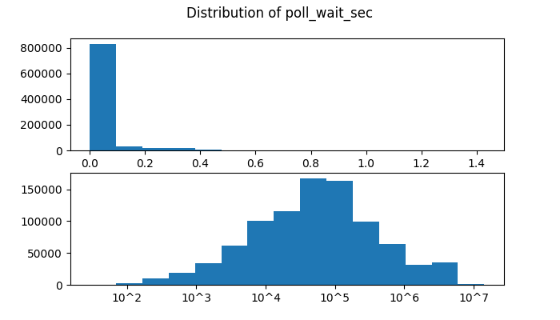
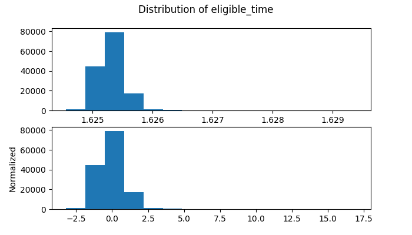

# Data

The data is found in the <b>data</b> module at the root of the project and is separated into folders according to format and clusters.
  
Data collection is spread over several consecutive days. Every day at noon, a snapshot of the status of all uncompleted jobs on the cluster is captured. This moment of capturing the state of the cluster, or snapshot, is represented by the variable <i>poll_time</i>.
  
The variable to be predicted is <i>poll_wait_sec</i>, which corresponds to the difference, in seconds, between the moment when we take the snapshot and the moment when the job actually starts running on the compute cluster. This quantity cannot be determined yet at the time the snapshot is taken because we need to look into the future in order to determine when a given job will indeed start running. This requires some care in the collection of data, and it also creates two kinds of features: those that can be measured at the time that a job is submitted, and those that can only be known later. Naturally, we want to use the former to make predictions about the latter.
  

## Data composition

The data consists of csv files, each representing a snapshot of the state of jobs on the Cedar and Graham clusters at noon for a given day in the months of May, June and July 2021. In total, 68 files were provided for Cedar, and 61 files for Graham. Cedar's total record count for all days is 1,125,293, while Graham's is 334,748. A record corresponds to the state of a particular job. This state is described by 97 variables, among which 16 have been obtained by the <code>sacct</code> command and 81 are "augmented", i.e. they have been calculated from other variables or retrieved a posteriori. The 16 variables obtained by <code>sacct</code> characterize the current job, while the others characterize the state of the cluster with respect to the current job.
  
Some variables are not used for training, either because they come from a linear transformation of <i>poll_wait_sec</i>, therefore to be excluded from the wait time prediction task, or because they are redundant (i.e. different units). Variables that are not available at prediction time are removed. In the end, 76 variables are used for training. These variables, which we will call features, are listed in the <b>features.py</b> file of the <b>code.wait_time_prediction</b> module.
  
The data has been anonymized by converting the user identity to an integer, as well as removing many of the identifying features that would otherwise be reported by Slurm. We wanted to keep the ability to determine if two jobs belonged to the same user by comparing the user id.
  

## Data distribution

The plot below shows the distribution of the variable to be predicted, <i>poll_wait_sec</i>, without transformation (top graph) and with a base-10 logarithmic transformation (bottom graph).
  

  <table>
  <tr>
    <td>
    </td>
  </tr>
  </table>

 <i>Distribution of poll_wait_sec (to be predicted). Top, without transformation (1e6 scale). Below, with log10 transformation.
 </i>

 
Without this transformation, the distribution of the variable appears unbalanced. There is a concentration of points between 0 and 0.25 (values ​​are multiplied by 106), which corresponds to an interval from 0 to 69.4 hours. The majority of jobs are found in this interval. It is also intuitively reasonable to expect that wait times would be distributed more uniformly in terms of orders of magnitude (e.g. so many will run in 30 minutes, in an hour, in 2 hours, in 4 hours, and so on). The computational demands of jobs running on large-scale compute cluster are probably also spread more uniformly across orders of magnitudes.
  
From this observation came the idea of <i>predicting the order of magnitude of the waiting time, instead of its exact value</i>. This has the immediate benefit of stabilizing training by SGD, but we feel that it also makes more useful predictions. Indeed, if the mean-square error (MSE) was used across values in the range [0, 1e6], there would be an incentive for conservative guesses to be close the the mid-point of that interval. If 97% of jobs run immediately but 3% of jobs spend a whole month queued, we do not want to have the conserative guess be that "a given job will wait a full day". We would rather make a prediction that jobs will run immediately. Using logs and mimizing the MSE on logs better achieves that.
  
We find that with the logarithmic transformation (bottom graph), the distribution approximates more to a normal distribution. We chose log10 transformation for its ease of interpretation, but we could have chosen any other base without affecting the optimal solution. The MSE would have simply been scaled by a constant factor.
  
We have also chosen to standardize all the input variables, so that the values ​​are under the same scale. The motivation for this is to have a more stable optimization problem, which is different from our motivation to transform the variable to be predicted. To show this transformation, we represent below the distribution of <i>eligible_time</i>. This plot represents the distribution of this feature without transformation and with a standard normalization, so that the mean of the values is 0 and the variance is 1.
  

  <table>
  <tr>
    <td>
    </td>
  </tr>
  </table>

 <i>Distribution of eligible_time (i.e. time when a job becomes eligible to run). Top, without transformation (1e9 scale). Bottom, with standard normalization.
 </i>

