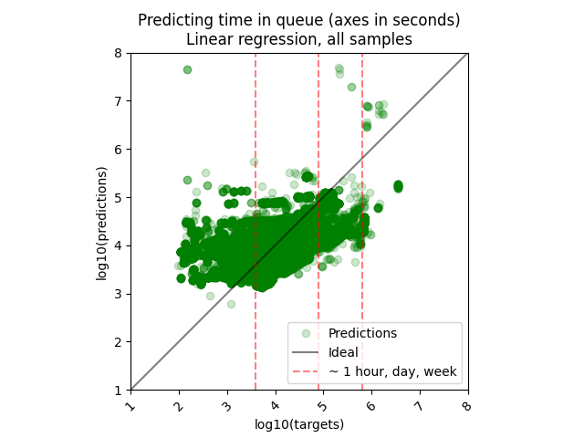
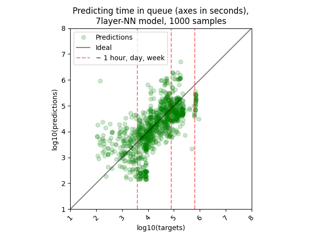
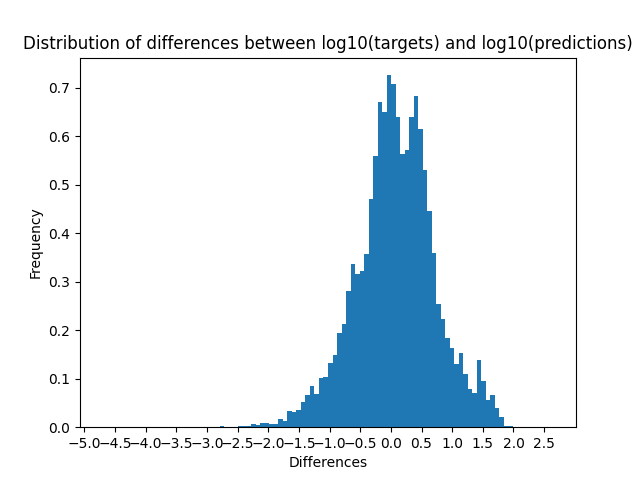
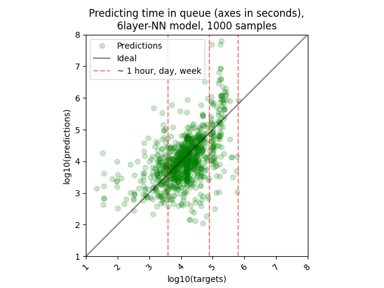
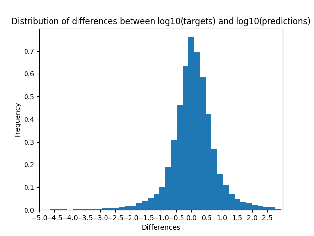

# Results

## Linear model

The MSE losses calculated with the exact solution, on a base 10 logarithmic scale, are 0.3174 for training, 0.7462 for validation and 0.4134 for testing. 
  
The following plot shows the predictions obtained after training the linear model according to the true jobs’ queue times (right graph). The black line that cuts the plane in half on the diagonal corresponds to the result that we would obtain if the model made no prediction errors. The red hatched lines are used to position real (non-logarithmic) wait time values on the x-axis.
  

 <table>
  <tr>
   <td>
   </td>
  </tr>
 </table>
 <i>Predictions obtained with the linear model, after training on Cedar data.
 </i>

 
The training, validation and test losses with the linear model, on a base 10 logarithmic scale, are 0.4046, 0.8315 and 0.4224 respectively. We see in the figure above that the model has trouble predicting values that are below 3, which corresponds to about 20 minutes of waiting (103 seconds = 20 minutes). Indeed, few examples of jobs with a waiting time (poll_wait_sec) of 20 minutes or less are present in the dataset, which explains this difficulty. 
  
Overall, we find that the model trains correctly, since the predictions obtained after training are very close to the predictions obtained with the least squares (exact) solution.
  

## Non-linear model

### With data from Cedar

The following figure shows the predictions obtained from the 10 separate training runs of the 7-layer model described in <a href="1_Methods.md"> Methods</a> according to true wait times.
  

 <table>
  <tr>
   <td>
   </td>
  </tr>
 </table>
 <i>Wait time predictions obtained with the 7-layer neural network model after training on Cedar data (1000 randomly chosen examples).
 </i>

 

The training, validation, and test losses are calculated by taking the average of 10 training runs of the model. These are the MSE based on the differences between `log10(pred)` and `log10(target)` values.
  

 
| | MSE on log10 values |
|-|---------------------|
|train| 0.2139 |
|valid| 0.3673 |
|test|  0.4299 |

  

 <table>
  <tr>
   <td>
   </td>
  </tr>
 </table>
 <i>Distribution of differences (in log10) between predictions and actual values of wait time for 10 separate training runs
 </i>

  

If we express that in terms of our original units of time, we have that:

- 38.19% of predicted *wait_time* falls into the interval [0.50*t, 2.0*t] with t being the real wait time in seconds,
- 56.76% of predicted *wait_time* falls into the interval [0.33*t, 3.0*t] with t being the real wait time in seconds.

 
Note that we are talking here about differences between predictions and original values without logarithmic transformation. That is to say, for a job whose execution is predicted in 2 hours, there is about a 38% chance that the job will actually be running on the SLURM cluster in an interval of [1 hour, 4 hours].
  

### With data from Graham

The following figure shows the predictions obtained from 10 separate training runs of the 6-layer model described in <a href="1_Methods.md"> Methods</a> according to the true wait times.
  

 <table>
  <tr>
   <td>
   </td>
  </tr>
 </table>
 <i>Wait time predictions obtained with the 6-layer neural network model after training on Graham data (1000 randomly chosen examples).
 </i>

 
The training, validation, and test losses are calculated by taking the average of 10 training runs of the model. These are the MSE based on the differences between `log10(pred)` and `log10(target)` values.
  

 
| | MSE on log10 values |
|-|---------------------|
|train| 0.2579 |
|valid| 0.4332 |
|test|  0.6583 |

  
The following histogram shows the distribution of differences for the 10 model training runs.
  

 <table>
  <tr>
   <td>
   </td>
  </tr>
 </table>
 <i>Distribution of differences (in log10) between predictions and actual values of wait time for 10 training runs of the 6-layer neural network model.
 </i>

 
Values below -5.0 are not shown for readability. These are 292 predictions below -5.0 that have been omitted from the histogram above out of a total of 150,420. As before, we can calculate the percentage of predictions that fall into the intervals [0.50*t, 2.0*t] and [0.33*t, 3.0*t]. This percentage is 41.60% and 59.89% respectively.
  

## Comparison with SLURM estimates

As a comparison, we can use the difference between the actual execution time of the jobs on the compute clusters and the value predicted by SLURM. This is equivalent to the difference between the actual and predicted waiting time. Indeed, SLURM provides an estimate based, among other things, on the time limit requested by the user for the job and the priority of other users’ jobs submitted afterwards. It is well known, however, that SLURM's estimation is grossly inaccurate.
  
We determined that the mean difference, on a base-10 logarithmic scale, for n=53 estimates on the Cedar cluster is 3.2032, while for n=58 estimates on the Narval cluster it is 2.4870. To calculate these values, fictitious jobs were submitted on these clusters and for each of them, the estimated job execution start time and the actual execution start time were retrieved. A difference of 3.2032 corresponds to approximately 1597 times the targets and a difference of 2.4870 corresponds to approximately 307 times the targets.

Here is a resume of the comparison between SLURM's estimator and our models' performance:
  

<table>
<thead>
<tr>
<th></th>
<th colspan=2>SLURM</th>
<th colspan=2>Neural network models</th>
</tr>
</thead>
<tbody>
<tr>
<td></td>
<td>Cedar</td>
<td>Narval</td>
<td>Cedar</td>
<td>Graham</td>
</tr>
<tr>
<td>Number of predictions</td>
<td>53</td>
<td>58</td>
<td>429,220</td>
<td>150,420</td>
</tr>
<tr>
<td>Mean difference</td>
<td>3.2032</td>
<td>2.4870</td>
<td>0.4299</td>
<td>0.6583</td>
</tr>
<tr>
<td>Interval of &gt;50% of predictions</td>
<td>[0.0006<em>t, 1596.61</em>t]</td>
<td>[0.0033<em>t, 306.9</em>t]</td>
<td>[0.37<em>t, 2.69</em>t]</td>
<td>[0.22<em>t, 4.55</em>t]</td>
</tr>
</tbody>
</table>

  
Dummy job data for the Cedar and Narval clusters is located in the project's <b>slurm_queue_time_pred.start_time_estimation</b> module.

