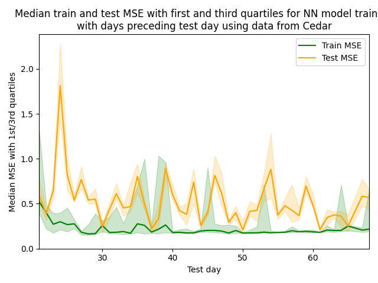

# Training on Past Data

<div align="justify">Rather than randomly choosing test days from the dataset, another approach is to train the model on all days prior to the test day. In the normal operating environment, only past data is available for training. The model should make predictions about jobs that have not yet been executed. This chronological approach gives us performances that are more akin to those that we could observe in a production environment.
<br></br>
A new parameter <code>test_day</code> selects the day used to test the model. The days preceding the test day will be part of either the validation set or the training set, in a ratio of 20% and 80% respectively. The designation of either set is randomized to ensure that the distribution of the training and validation day data is similar. Days that come after <code>test_day</code> are ignored completely.
<br></br>
</div>

## Results

<div align="justify">This section presents the results obtained for each of the test days between the 21st and the last day of data from the Cedar cluster. Rather than testing the model on the last day only, we chose a range of test days to account for potential variability in jobs on the last day compared to previous days. We decided to explore values of <code>test_day>=21</code> in order to have sufficient data for training. 
<br><br>
The following plot shows the average MSE (y-axis) with the standard deviation over the training and test set for a sample of experiments where the model was trained on past data. We used the model described in <a href="1_Methods.md"> Methods</a> for Cedar. The x-axis represents each of the days selected for testing between the 21st and the last day of the dataset. 
<br><br>
<div align="center">
 <table>
  <tr>
   <td>
   </td>
  </tr>
 </table>
 <i>Average training (green curve) and test (yellow curve) MSE on the neural network's predictions when trained with the days before T = test day, with the standard deviation, using data from Cedar.
 </i>
</div>
<br>
The following figure shows the median MSE (y-axis) with the first and third quartiles as well as with the values just above and below the median over the training and test set for the same sample of training experiments.
<br><br>
<div align="center">
 <table>
  <tr>
   <td>
   </td>
   <td>
   </td>
  </tr>
 </table>
 <i>Median training (curve in green) and test (curve in yellow) MSE on neural network's predictions when trained with the days before T = test day, with the first and third quartiles (left) and values ​​just below and just above the median (right), using data from Cedar.
 </i>
</div>
<br>
In the figures above, the results for the 66th day of testing have been omitted, since the mean, 16.9086, and median, 8.2979, squared error values ​​over the test set were too distant from the rest. Their presence made the graphs difficult to read. These outliers could be attributed to differences in job characteristics present on that day compared to those on other days of data.
<br><br>
Using the maximum days for training the model (T=68), we obtain an average training, validation and test loss of 0.3727, 0.4468 and 0.5956 respectively. The percentage of test predictions that fall into the intervals [0.50*t, 2.0*t] and [0.33*t, 3.0*t], t being the real wait time in seconds, is 33.30% and 50.38% respectively. We can also notice that adding days for training the model has no significant impact on the prediction error, which follows a constant trend.
<br><br>
</div>

## Code Documentation

<div align="justify">To run a training experiment on past data, run the <code>run_experiment.py</code> script from the <b>slurm_queue_time_pred.train_on_previous_days</b> module specifying the desired training (hyper)parameters, as listed in <a href="1_Methods.md"> Methods</a>. The <code>--features</code> argument does not apply. Here are the additional arguments:
<br></br>
</div>
<table>
 <tr>
  <td>-T, --test_day
  </td>	 	
  <td>Limit between the days corresponding to the data in the training and validation sets and the test day
  </td>
  <td>Default: 3*
  </td>
 </tr>
  <tr>
  <td>--single_run
  </td>	 	
  <td>If present, a single experiment with the specified parameters is executed (optional)
  </td>
  <td>Default: NN*
  </td>
 </tr>
</table>

<div align="justify">* Corresponds to the minimum value allowed for the test day. One day will thus be allocated for training the model and a second for validation.
<br><br>
 Here is an example of running the script from anywhere (with the proper setup of <code>PYTHONPATH</code>):
</div>

```
python3 slurm-queue-time-pred/slurm_queue_time_pred/train_on_previous_days/parallel_run.py --test_day=37 --nbr_layers=3 --single_run
```

<div align="justify">To generate the results of the training on past days experiments, run the <code>report_results.py</code> script from the <code>slurm_queue_time_pred.train_on_previous_days</code> module specifying the (hyper)parameters of the experiments for which the results will be generated in the results.previous_days_results directory, as listed in <a href="1_Methods.md"> Methods</a>. This will generate five graphs with, depending on the test day, the average GPU usage and the average duration of experiments, the average training and test MSE, the average training and test MSE with standard deviation, the median training and test MSE with 1st and 3rd quartiles and finally the median training and test MSE with values just above and just below.
<br><br>
Here is an example:
</div>

```
python3 slurm-queue-time-pred/slurm_queue_time_pred/train_on_previous_days/report_results.py --nbr_layers=3 --hidden_size=64 --cluster=graham
```
