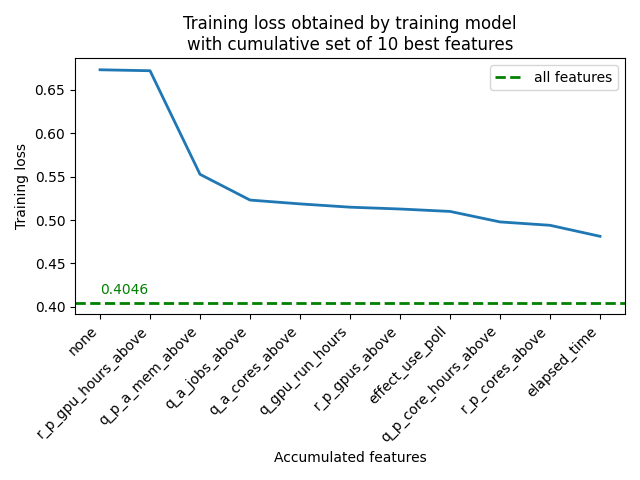
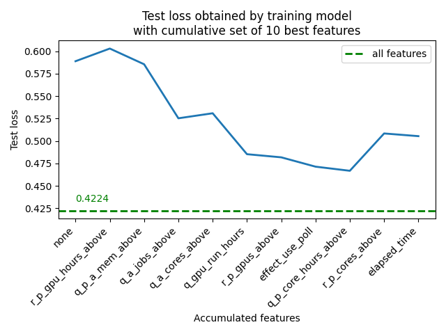
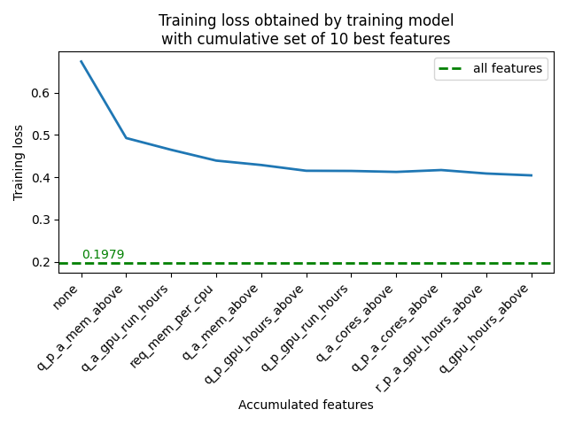
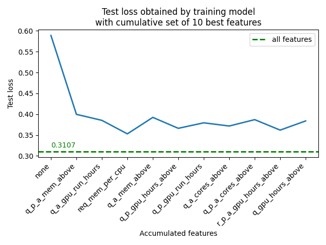

# Feature exploration

One of the expectations of collaborators at the DRAC is to know the most significant features for predicting the waiting time of a job, for explainability purposes and to guide users on the choice of parameters for the `sbatch` and `salloc` commands when submitting jobs on compute clusters. Thus, we wanted to determine the features that best predict waiting time, that is those which, taken one at a time, produce the lowest MSE.
<br><br>
The method we used to do this is to train a model with all the features individually, select the best one (the one that produces the lowest MSE), train the model with that feature and each of the unselected features, select the best combination of two features (including the one selected in the first step), and so on, until having selected the 10 best features and having trained the model with the combination of these.
<br><br>

## Results

The following figures show the results of the feature exploration with the linear model and the 7-layer neural network model used to make predictions on Cedar data. For each of the models, the curves of the training and test loss (MSE) according to the cumulative features for the training are presented.
<br><br>
<p align="center">
 <table>
  <tr>
   <td>
   </td>
   <td>
   </td>
  </tr>
 </table>
</p>
<p align="center">
 <i>Training (left) and test (right) loss according to cumulative features used for training the linear model, using data from Cedar.
 </i>
</p>
<br>
<br><br>
<p align="center">
 <table>
  <tr>
   <td>
   </td>
   <td>
   </td>
  </tr>
 </table>
</p>
<p align="center">
 <i>Training (left) and test (right) loss according to cumulative features used for training the 7-layer neural network model, using data from Cedar.
 </i>
</p>
<br>
The green hatched lines in the graphs above represent the MSE obtained by training the model with the set of all features (76). The loss cannot fall below this line with less training features. It is expected that the loss decreases monotonically, since the model always has the possibility of putting a zero coefficient in front of a feature which is not used for the prediction.
<br><br>
We find that the features selected by each of the models and the order of selection vary. This can be explained by the varying complexity of the models used; from the linear model to the 7-layer model, the complexity increases. Despite this, there is a tendency for models to choose “augmented” features, with the presence of *_above features that provide information related to the jobs that precede a given job. Among these jobs, those pending with higher priority (q_*_above) seem to have a greater predictive importance than the running jobs (r_*_above). Overall, the amount of memory, GPUs and CPU cores used on the computing cluster when submitting the job appear to be good predictors of the job’s waiting time.
<br><br>

## Code Documentation

To run a feature exploration experiment, run the **run_experiment.py** script from the **code.explore_features** module specifying the desired training (hyper)parameters, as listed in [Methods](docs/1_Methods.md). The features argument does not apply. Here are the additional arguments:

<table>
 <tr>
  <td>-n, --nbr_top_features
  </td>	 	
  <td>Number of cumulative features used for training
  </td>
  <td>Default: 10
  </td>
 </tr>
  <tr>
  <td>--output_dir
  </td>	 	
  <td>Directory name of the results.exploration_results directory  where the results JSON files will be written
  </td>
  <td>
  </td>
 </tr>
</table>
<br>

Here is an example of running the script from outside the project root:

```
python3 slurm-queue-time-pred/code/explore_features/run_experiment.py --nbr_top_features=15 --output_dir=example_experiment
```

To generate the results of the best predictive features exploration, run the **report_results.py** script from the **code.explore_features** module using the same arguments as those used to launch the experiment. It is possible to choose a different number of accumulated features to produce the results files. An additional argument, synthetic_data, if present, allows the use of loss references (MSE) associated with synthetic data. The script will generate a JSON file containing the progression of training, validation and test losses as well as the frequency and average of times these losses deteriorated with the addition of a new feature. It will also generate three graphs representing each of the losses according to the accumulation of the best features.
<br><br>
Here is an example of running the script from outside the project root:


```
python3 slurm-queue-time-pred/code/explore_features/report_results.py --nbr_top_features=10 --output_dir=example_experiment --synthetic_data
```